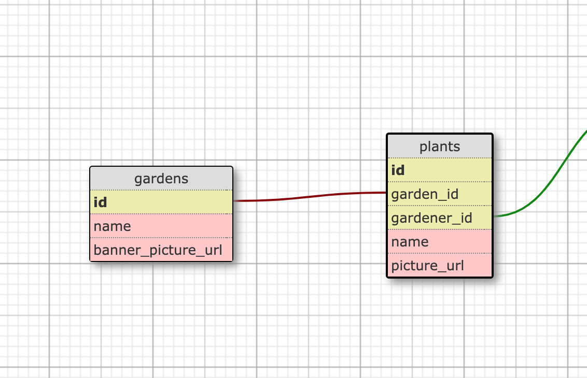

# Schema DB

## Tables
### Gardens
  - `name`
  - `banner_picture_url`

### Plants
  - `garden_id` (link to primary key of one specific garden)
  - `name`
  - `picture_url`

## DB schema

# User stories
- ✅ As a user I can see one garden's plants
- ✅ As a user I can add a plant in a garden
- ✅ As a user I can delete a plant
- ✅ Make it pretty 💅

# TODO after livecode
✅ Send link to Bootstrap variables 👉 https://bootstrapvars.com/
